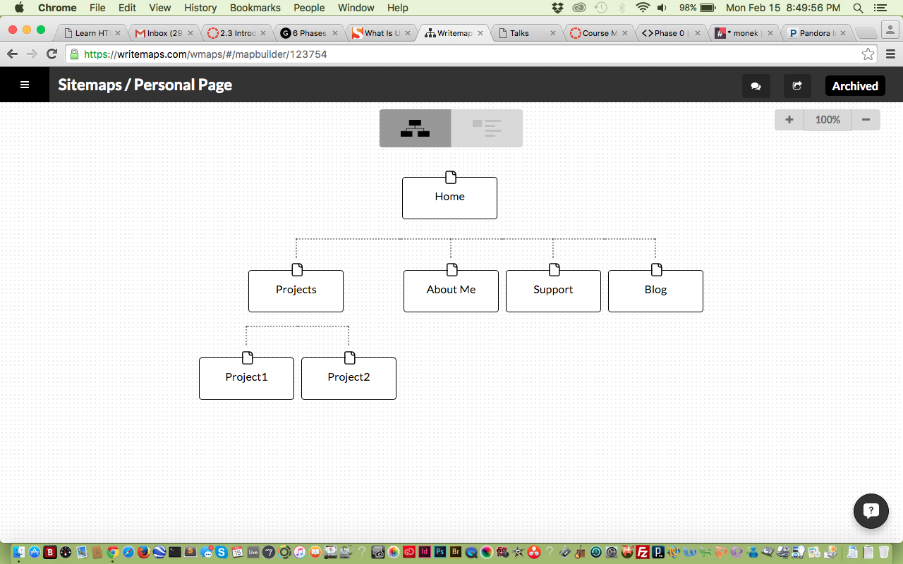

<html>
	

What are the 6 Phases of Web Design?
The 6 Phases of Web Design are:
1) Information Gathering - Where you get a solid understanding of the purpose of the webpage. Goals, Purpose, audience, content, etc.
2) Planning - Creating a site map to see list of all main topic areas of the site as well s sub-topics.  This is meant to serve as a guide for the content on the website.
3) Design - What will the site look like?  Knowing your target audience helps create an appropriate page.
4) Development - Actual creation of webpage after taking in all the information and laying it out via previous steps.
5) Testing and Delivery - Final details of website.  Testing complete functionality of forms/scripts, compatibility issues, etc.
6) Maintenance - Updates, new content, redesign, etc.

What is your site's primary goal or purpose? What kind of content will your site feature?
This site's primary goal is to serve as my professional website where I can show my work history, interests, backgrounds, projects, and blog.  It's a way to showcase myself to potential employers.

What is your target audience's interests and how do you see your site addressing them?
My target audience is employers in the field.  With that being the case, my site needs to reflect my abilities in a professional yet unique manner.  I'll have the essential sections as previously mentioned, but will hopefully have an appealing look to it.

What is the primary "action" the user should take when coming to your site? Do you want them to search for information, contact you, or see your portfolio? It's ok to have several actions at once, or different actions for different kinds of visitors.
I'd like my users to look at my portfolio.  So maybe a slideshow on the homepage glimpsing my work, with links they can press on that'll take them to those projects.  I want my contact info easily accessible, in case they choose to reach out to me.  I will provide a search tab and index to my work, in case they are visiting my site with a specific link/projct in mind.

What are the main things someone should know about design and user experience?
User Experience (UX) is how a person feels when interfacing a system.  You have to know your audience to be able to cater to them.  The more you know, the easier it'll be to create something they'll like and want to continue using.

What is user experience design and why is it valuable?
UX Design is about creating something users will enjoy.  This ranges from website value, difficulty of navigation, visually appealing, etc.  Basically, websites are meant to attract people to use them on a regularly basis.  Therefor, things must appeal to them on several different levels.  It's important to do so in order to maintain users.

Which parts of the challenge did you find tedious?
I didn't really have that hard of a time on this challenge.  I guess we'll see how that image turns out, because I saved that part for last.  Besides that, I guess moving the image file from my desktop to the imgs directory using only the terminal.  I kept moving it via cd ___ or ../ but moving one directory at a time.  I think there's a way to do so where I can move it directly from the desktop to a speficif directory instead of moving it up/down one at a time, but I couldn't find that information.
</html>