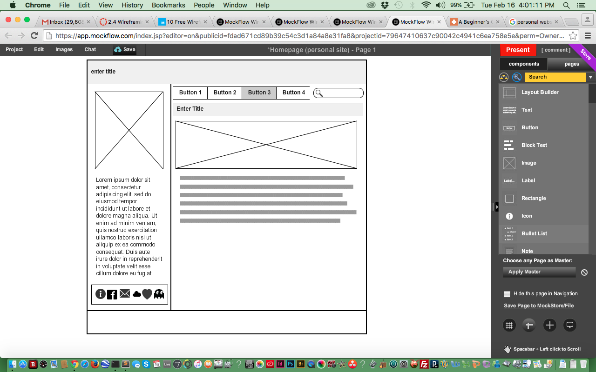
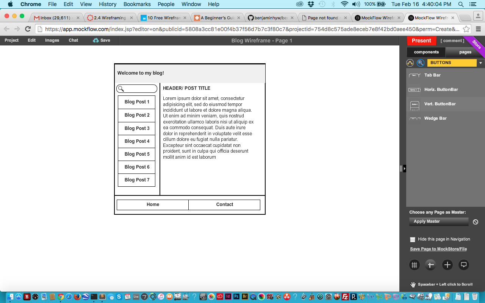

<html>
	
	
What is a wireframe?
A wireframe is basically a template for the website you are building.  It helps to visualize the website you are creating.

What are the benefits of wireframing?
It allows you to move components of your site as you see them fit.  It also cretaes the skeleton of what your site will look like, so it makes it easier to create the actual page later.

Did you enjoy wireframing your site?
I used MockFlow WireframePro.. it slowed my compter down so much it made creating it a little frustrating especially because I wasn't really sure what I wanted it to look like in the first place.  At one point I gave up using it and thought I would just draw it out, but then felt like I wasn't creative enough to just go about it on my own like that.  At least on these apps you have suggested components (if you steer clear from using an already existing template, I mean).  If my computer didn't get so slow I would've been fine.  Other than that, I did like wireframing my site because it allowed me to visually explore something I would then later fully create!

Did you revise your wireframe or stick with your first idea?
Like I mentioned my computer lagged so I tried to draw it out instead, which looked way different than what I initially tried on MockFlow.  Then when I tried it again I decided to look at other already existing personal pages and got some ideas from there, which I then tried incorporating in my third attempt at creating a wireframe.  I revised and there will definitley be more revisions to come.

What questions did you ask during this challenge? What resources did you find to help you answer them?
I was trying to figure out what layout i'd like to have.  So that's really what I kept asking myself.  "What do you even want this to look like, dude?"
I referenced other pages online, just did a quick google search and came across a bunch of those "Top [insert number] personal pages ever!!!1!"  Briefly glanced over them and tried taking a few elements from them.

Which parts of the challenge did you enjoy and which parts did you find tedious?
I liked looking at how nice people have made their own personal pages.  Kinda reminds me of back when I used to personalize my myspace page lol..  Similarly I've played with tumblr layouts in the past, so the similarity was cool because it tapped into probably the only thing i'm somewhat familiar with in the DBC curriculum. &hearts;

I hated the cmputer lag. So so much.  I almost had to restart my computer, and will definitely have to restart before continuing any major tasks on it again.  My poor macbook.. I think it's like 11 years old now.  Forgot to wish it a happy birthday!

</html>