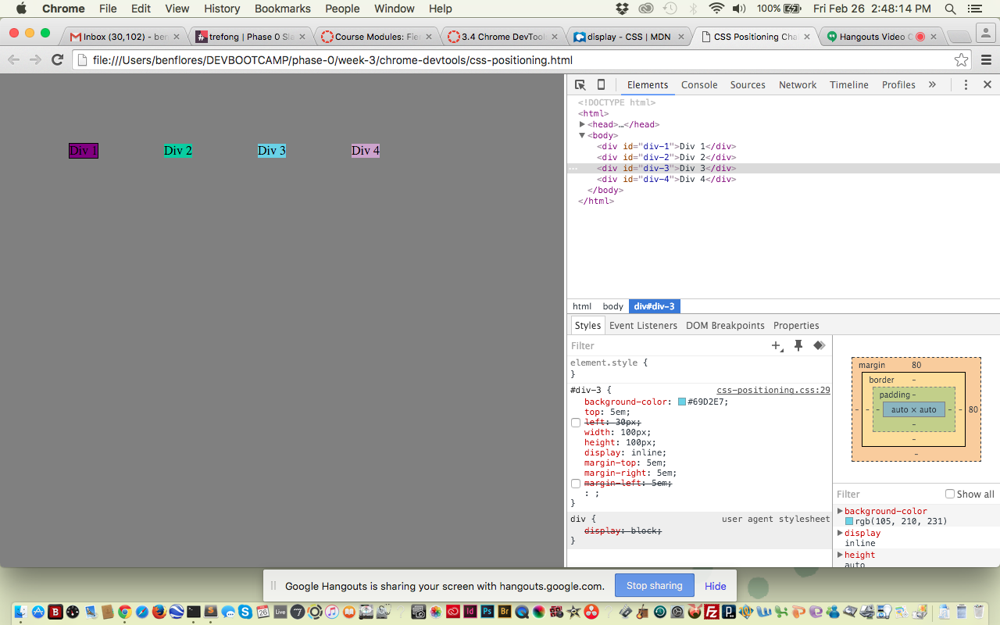

<html>

How can you use Chrome's DevTools inspector to help you format or position elements?
It's a nice way to test out some coding without affecting the actual page!  It gives you real time updates, which is pretty nice.

How can you resize elements on the DOM using CSS?
You tweak their properties, height/width etc etc.

What are the differences between absolute, fixed, static, and relative positioning? Which did you find easiest to use? Which was most difficult?
Absolute: positioned in one assigned place, relative to the closest positioned ancestor.
Fixed: Positioned in one assigned place elative to the screen viewport, does not move when you scroll page etc.
Static: Elements are able to use their normal behavior. 
Relative:  Elements are placed as if not positioned, then we adjust the elements position without changing layout.

Absolute and fixed were both the easiest for me, probably because you assign their location and they stay there.  Relative was the hardest for me because it's affected by the previous element.

What are the differences between margin, border, and padding?
Margin is the space between the element and the "wall".  By wall I mean end of the screen/workplace.
Border is what contains your element.
Padding is what is between the border and the element.

What was your impression of this challenge overall? (love, hate, and why?)
It was cool but a little annoying at times lol.  I did think it was helpful in terms of using devtools and just playing around with a page, but found a few of the assignments frustrating.  However that's probably just because I'm still learning!

</html>