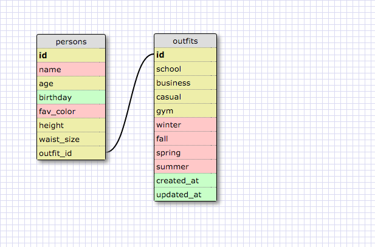

1. Select all data for all states.
	
	SELECT * FROM states;

2. Select all data for all regions.
	
	SELECT * FROM regions;

3. Select the state_name and population for all states.
	
	SELECT state_name, population FROM states;

4. Select the state_name and population for all states ordered by population. The state with the highest population should be at the top.
	
	SELECT state_name, population FROM states ORDER BY population DESC;

5. Select the state_name for the states in region 7.
	
	SELECT state_name FROM states WHERE region_id IN (7);

6. Select the state_name and population_density for states with a population density over 50 ordered from least to most dense.
	
	SELECT state_name, population_density FROM states WHERE population_density > 50 ORDER BY population_density ASC;

7. Select the state_name for states with a population between 1 million and 1.5 million people.
	
	SELECT state_name FROM states WHERE population BETWEEN 1000000 AND 1500000;

8. Select the state_name and region_id for states ordered by region in ascending order.
	
	SELECT state_name, region_id FROM states ORDER BY region_id ASC;

9. Select the region_name for the regions with "Central" in the name.
	
	SELECT region_name FROM regions WHERE region_name LIKE '%Central%';

10. Select the region_name and the state_name for all states and regions in ascending order by region_id. Refer to the region by name. (This will involve joining the tables).
	
	SELECT regions.region_name, states.state_name FROM states INNER JOIN regions ON states.region_id=regions.id ORDER BY region_id ASC;

REFLECTION:

What are databases for?
They help keep a ton of information in one place.  They're used to access that info using SQL (Structured Query Language)

What is a one-to-many relationship?
A one-to-many relationship is one in which a row in one table can have multiple matching rows in another table.  This relationship can be created using Primary Keys - Foreign Keys

What is a primary key? What is a foreign key? How can you determine which is which?
A primary key uniquely identifies a record in the table, a foreign key is a field in the table that is a primary key in another table.  Basically, they are what link the two together when joining information.  The way I understood it, it's easy to determine which is primary and which is foreign depending on the name given to the id.  For example, the states table had region_id whereas the region table just had id.  In this case, the region table holds the primary key while the states table holds the foreign key.

How can you select information out of a SQL database? What are some general guidelines for that?
Your notation has to be super specific as to what you're trying to access.  General guidelines: main key words have to be capitalized, always end with a semicolon, make sure to order your commands correctly.

Generally looks like:

SELECT row_name FROM table_name;
The more specific you wanna be, the more precise your notation will look like.

