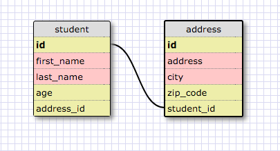
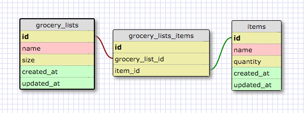

RELEASE 2:

This example shows the relationsihp between a student and their address.  This information, in certain circumstances, may be maintained better if it was seperate, like we see here.  In this case, we create a one-to-one schema in which the Student table holds the primary key and Address holds the foreign key.  This relaitonship is one to one because we don't have any othr tables involved, and the information as it stands is only being accessed from one to the other.  Even if there were more tables linked up, if two tables have specific ids to reference each other and that's the only way THOSE tables interact, then they have a one to one relationship.

What is a one-to-one database?
A one-to-one relationship relates two tables of informtion uniqueley.

When would you use a one-to-one database? (Think generally, not in terms of the example you created).
Whenever you wanted to have a unique relatinship between tables of information.

What is a many-to-many database?
Many-to-many relationships basically allow information to flow between tables in several different ways.  You can think of books an authors for this one.  Books can be created by several authors, auhors can create several books.

When would you use a many-to-many database? (Think generally, not in terms of the example you created).
Whenever you have information that can be contributed to, taken from, and able to create/take from something else.

What is confusing about database schemas? What makes sense?
They're not confusing conceptually but i'm still having a hard time being able to define them when asked to write about them.  Also, seeing practical uses of one to ones...